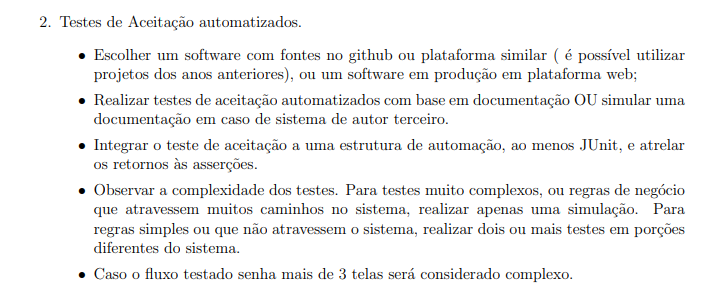
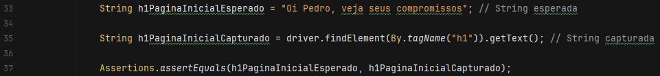
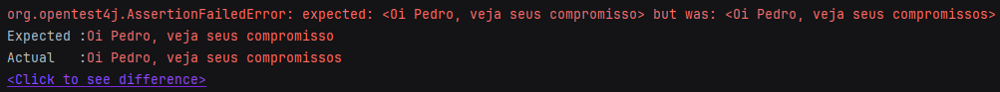
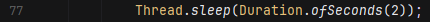

# Projeto A3 - Gestão e qualidade de software

### Este é projeto acadêmico que compreende o desenvolvimento de um sitema para realizar teste automatizados na plataforma digital Ulife, utilizando a linguagem de programação Java, juntamente do framework Junit e do emulador de usuários Selenuim WebDriver.

## Integrantes e Professores

### Professores

- Orlando clinico Patriarcha
- Nelson Issamu Shimada

### Integrantes
- Gabriel Pereira Brito RA 12522159893
- Heitor Reiter Savino RA 12522159893
- Henrique Menezes Grizão RA 12522126500
- Maria Carolina Calau da Silva RA 12522225332
- Pedro Henrique Santana Xavier RA 12522190539
- Victória Verônica de Andrade Baltazar RA 12522170259

## Objetivos do projeto

Conforme o que foi dito na introdução, o software escolhido para o desenvolvimento dos testes foi o site Ulife. 
Como o site possui uma quantidade considerável de funções, apenas 2 funcionalidades, a página de login e o sistema de
envio e recebimento de mensagens.

## Pastas 

Esta é a estrutura de arquivos do projeto

Onde as pastas driver e test são as mais utilizadas. Na pasta driver está o driver do chrome, que necessário para que o selenium WebDriver possa utilizar as funcionalidades do navegador. E a pasta de tests, na qual está o código principal do projeto, os testes.

Também vale destacar as dependências utilizadas no projeto, que estão no arquivo pom;

        <dependency>
            <groupId>org.seleniumhq.selenium</groupId>
            <artifactId>selenium-java</artifactId>
            <version>4.15.0</version>
        </dependency>

        <dependency>
            <groupId>junit</groupId>
            <artifactId>junit</artifactId>
            <version>4.13.2</version>
            <scope>test</scope>
        </dependency>

        <dependency>
            <groupId>org.junit.jupiter</groupId>
            <artifactId>junit-jupiter</artifactId>
            <version>RELEASE</version>
            <scope>test</scope>
        </dependency>

## Código

### Classe "MensagensTests"

#### método "DeveriaEfetuarLogin"

Este é o primeiro método da classe de test, como principais pontos de destaque, é possivel apontar a annotation @Test (linha 17)
que define o método "DeveriaEfetuarLogin" como um método de para testes.

Na linha 21 está sendo configuranda a propriedade do sistema chamada "webdriver.chrome.driver" com o caminho para o executável do ChromeDrive,
essa linha de código é necessária para informar ao Selenium onde encontrar o executável do ChromeDriver no sistema.

Na linha 22 esta sendo crianda uma instância do WebDriver para o navegador Google Chrome. Sendo um pouco mais específico, o WebDriver é uma interface do Selenium que define métodos para interagir com um navegador, 
ja o ChromeDriver é uma classe específica para o navegador Google Chrome no Selenium WebDriver, essa classe implementa os métodos definidos na interface WebDriver para interagir com o Chrome.
Isso significa que o "driver" agora é um objeto que pode ser usado para controlar o navegador Chrome por meio diversos métodos.

Como exemplos é possível citar o método driver.get("https://www.ulife.com.br/login.aspx"); utilizado para acessar a pagina de login do ulife, ou qualquer outra url que seja colacada entre as aspas. 
E o método findElement, utilizado para encontrar elementos numa página web, também vale apena citar o método By, que define qual será o parâmetro utilizado para localizar os elementos, ex;

driver.findElement(By.id("txtLogin")); o parâmetro definido foi o id do elemento que se deseja encontrar, no caso do exemplo, "txtLogin".

Neste método também é possivel visualizar um assert, que é um método do Junit utilizado para verificar se uma condição é verdadeira.

Neste caso temos a String h1PaginaInicialEsperado (linha 33), que é o valor que esperamos encontrar em determinado elemento (linha 35).

Caso o assert não seja verdadeiro será exibida uma mensagem de erro;

O erro foi forçado apenas para exemplificação.

#### Método "DeveriaEnviarMensagem"

Neste método o sistema de envio e recebimento de mensagens é testado. Embora esteja seguindo o mesmo padrão do método "DeveriaEfetuarLogin", existem algumas peculidaridades que devem ser destacadas.

E os iframes são uma dessas peculiaridades, os iframes (Inline frames) são tags HTML usadas para incorporar um documento HTML dentro de outro. 
Ele permite que você inclua conteúdo de uma fonte externa, como uma página da web, em um documento HTML, ou seja, para localizar elementos que estejam dentro de um iframe é necessario acessá-lo.  

Na linha 60, estamos localizando um iframe na página pelo seu id, que neste caso é "iMessage", e o armazenando na variável iframeDestinatario que é do tipo WebElement. WebElement é uma interface do selenium, que armazena elementos de uma página web.

Na linha 62, estamos utilizando método switchTo() para mudar o foco do selenium para o contexto do iframe que queremos acessar. Conxteto representa a página web com a qual o Selenium está interagindo.
Ao mudar o foco, podemos localizar elementos dentro do iframe.

Outro ponto importante é o uso do como Thread.sleep;

As vezes o Selenium é executado mais rápido que o navegador, por conta disso alguns elementos que são carregados com atraso podem ser encontrados, ocasionando erros. Neste caso está sendo feita uma pausa de 2 segundos na execução do programa.   

Por fim realizamos os asserts para confirmar se a mensagem que foi capturada confere com a mensagem que foi envia. Para isso armazenamos previamente o texto que será enviado em três Strings;

Em seguida capturamos a mensagem que foi enviada;

Nota-se que foi necessario acessar outro iframe para capturar o corpo da mensagem. E no final os asserts conferem as mensagens

 

